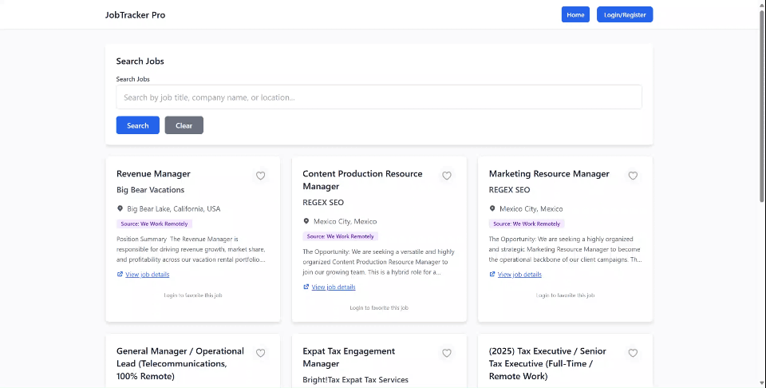

# 🚀 JobTracker Pro - Intelligent Job Tracking Platform

**JobTracker Pro** is a full-stack job recommendation platform designed for precision matching.

It implements a **Hybrid Search Engine** combining SQL-based keyword filtering with **RAG (Retrieval-Augmented Generation)** vector search, fused via the **RRF (Reciprocal Rank Fusion)** algorithm. The system uses **Redis** caching to optimize performance.




## ✨ Features

* 🔍 **Hybrid Search** \- Combines traditional keyword matching with semantic vector search for better relevance.  
* 🤖 **AI Recommendations** \- Uses RAG & RRF algorithms to recommend jobs based on resume analysis.  
* 📊 **Performance Optimized** \- Implements Redis caching for high-frequency endpoints.  
* 🕷️ **Automated Data Pipeline** \- Python scraper fetches RSS feeds with two-phase commit (Java \-\> Vector DB).  
* 📄 **Resume Analysis** \- Upload PDF/Word resumes for vector-based matching.  
* 🔐 **Secure Auth** \- JWT-based stateless authentication with Spring Security.  
* ☁️ **DevOps Ready** \- Fully containerized with CI/CD pipelines deploying to AWS.

## 🛠️ Tech Stack

### Frontend
* **Framework**: React 18, TypeScript, Vite  
* **UI Library**: Tailwind CSS  
* **Web Server**: Nginx

### Backend
* **Core**: Spring Boot 3, Java 17  
* **Caching**: **Redis** (Spring Data Redis)  
* **Database**: PostgreSQL 15 (Relational \+ Vector)  
* **Security**: Spring Security, JWT

### AI Service
* **Core**: Python 3.9, Flask  
* **ML Ops**: LangChain, Sentence-Transformers (HuggingFace)  
* **Vector Store**: pgvector  
* **Data Processing**: BeautifulSoup4, Feedparser

### **Infrastructure**

* **Containerization**: Docker, Docker Compose  
* **Cloud Provider**: AWS EC2  
* **CI/CD**: GitHub Actions

## 📦 DevOps Architecture

This project implements a complete CI/CD workflow:

1.  **Push**: Code pushed to `main` triggers the pipeline.
2.  **Build**: GitHub Actions builds Docker images for Backend, Frontend, and AI Service.
3.  **Push**: Images are pushed to **Docker Hub**.
4.  **Deploy**: The pipeline connects to the **AWS EC2** instance via SSH, pulls the latest images, and restarts the containers using Docker Compose.

## 🚀 Performance Highlights: Redis Caching

To validate system performance, we conducted a load test on the core API using JMeter. The results show a significant performance boost after implementing Redis caching.

**Test Conditions**: 100 concurrent users for a duration of 5 minutes.

| Metric | Without Cache (Database Only) | **With Redis Cache** | Performance Gain |
| :--- | :--- | :--- | :--- |
| **Throughput** | 1623 req/s | **2656 req/s** | **+64%** |
| **Avg. Response Time** | 60 ms | **37 ms** | **-38%** |

The integration of Redis increased the application's overall throughput by over **60%** and significantly reduced user response times, confirming the high performance and stability of the architecture.

## 🚀 Local Quick Start

If you want to run this locally instead of visiting the live demo:

### **1\. Clone the Repository**

```bash
git clone \[https://github.com/ZhanLiQxQ/JobTracker-Pro\](https://github.com/ZhanLiQxQ/JobTracker-Pro)  
cd JobTracker-Pro
```

### **2\. Configure Environment Variables**

**⚠️ Important**: Create a .env file in the project root before starting services.

```bash
touch .env
```

Add the following configuration (adjust passwords for production):

```bash

# Database Configuration
DB_URL=jdbc:postgresql://jobtracker-pro-db-1:5432/jobtracker
DB_USERNAME=admin
DB_PASSWORD=your_secure_password

# Security Configuration
SPRING_SECURITY_USER_NAME=admin
SPRING_SECURITY_USER_PASSWORD=your_secure_password
JWT_SECRET=your-super-secure-jwt-secret-key-at-least-64-chars
INTERNAL_API_KEY=your-long-random-internal-api-key

# Redis Configuration
REDIS_HOST=jobtracker-pro-redis-1
REDIS_PORT=6379

# Service URLs (Docker Network)
AI_SERVICE_URL=http://jobtracker-pro-ai_service-1:5000
WEB_CLIENT_BASE_URL=http://localhost:80
```


### 3. Start Services

```bash
docker-compose up -d --build
```

### 4. Initialize Data
Run the scraper inside the container to fetch real-time jobs and populate the database:

```bash
docker exec -it jobtracker-pro-ai_service-1 python main.py
```


### 6. Access the Application

- **Frontend Interface**: http://localhost (served by Nginx)
- **Backend API**: http://localhost:8080 (direct access)
- **AI Service**: http://localhost:5001 (direct access)

**Note**: The frontend is served through Nginx which acts as a reverse proxy, automatically routing `/api` requests to the backend service.


## **📱 User Guide**

1. **Register/Login**: Create an account to access features.  
2. **Hybrid Search**: Enter keywords (e.g., "Java Developer") to trigger the SQL+Vector hybrid search.  
3. **Resume Match**: Go to "Resume Upload", upload a PDF, and view AI-recommended jobs.  
4. **Favorites**: Save jobs to your personal list.

## 🔧 Development Guide

### Project Structure

```
JobTracker-Pro/
├── frontend/          # React frontend application (served by Nginx)
│   ├── Nginx.conf     # Nginx configuration for reverse proxy
│   └── Dockerfile     # Multi-stage build: Node.js + Nginx
├── backend/           # Spring Boot backend service
├── ai_service/        # Python AI recommendation service
├── docker-compose.yml # Docker orchestration configuration
└── README.md
```

### **Common Commands**

**Check Logs:**

docker-compose logs \-f backend

**Database Management

```bash
# Connect to database
docker exec -it jobtracker-pro-db-1 psql -U admin -d jobtracker

# View table structure
\dt

# View data
SELECT * FROM job LIMIT 10;
```


## 📄 License

This project is licensed under the MIT License - see the [LICENSE](LICENSE) file for details

---
Feel free to open an issue if you have any questions, suggestions, or concerns🥺🥹.
